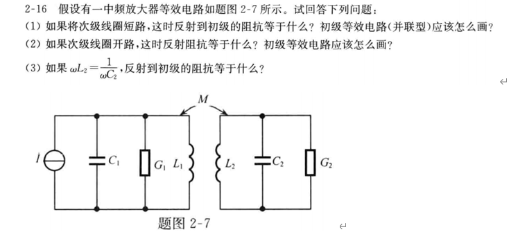
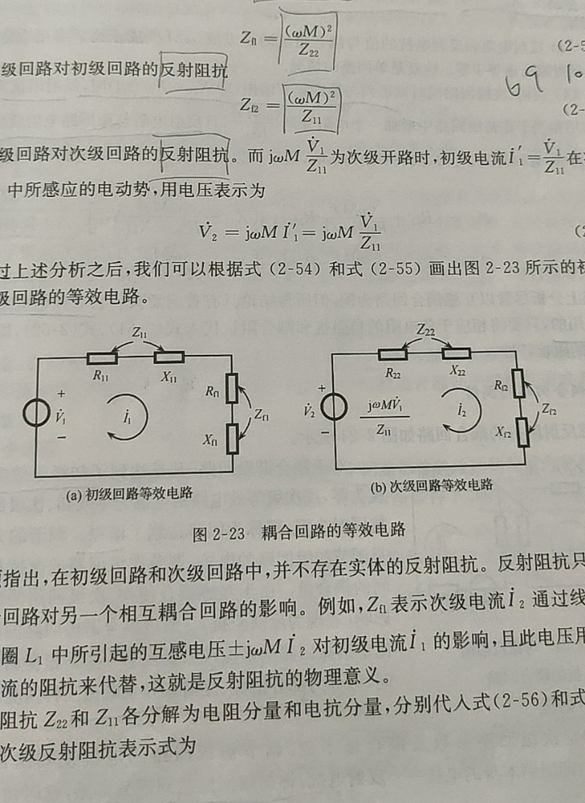
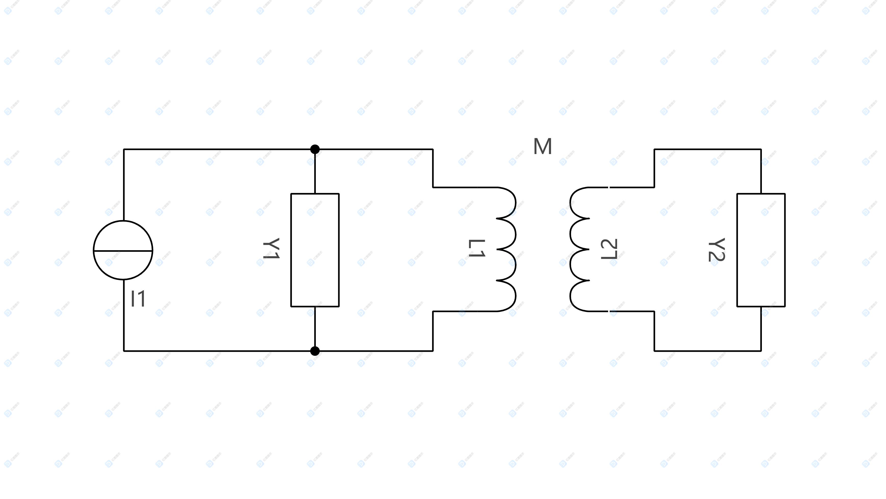
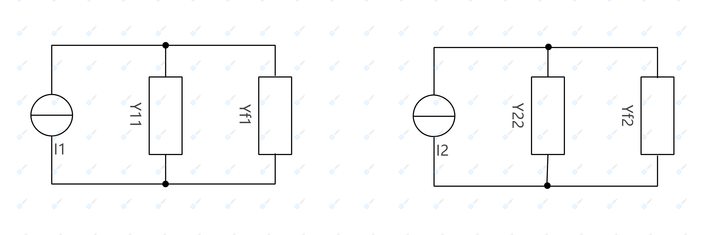

# 一道高频电子题目
这个学期我们高频老师布置了一道题目，如下：

我一看，这不就是电路里的磁耦合吗，但是翻开高频书（严国萍主编）一看：

书中只描述了串联情况下耦合回路的等效电路。而邱关源的《电路》也没有描述串联的情况。另外，CSDN也没有博主讲述过这个问题（不排除我没看到）。
# 理论推导
首先明确以下符号，电阻R，电导G，电抗X，电纳B，阻抗Z，导纳Y。
变压器电路如下：

假设
$$
Y_{11}=Y_1+L_1
\tag{1} 
$$
$$
Y_{22}=Y_2+L_2
\tag{2} 
$$
又因为
$$
Y_M=\frac{1}{j\omega L}
\tag{3} 
$$
初、次级回路电流方程可写为：
$$
Y_{11}\mathop{U_1}\limits^.-\frac{\mathop{U_2}\limits^.}{j\omega L}=\mathop{I_1}\limits^.Y_{11}
\tag{4} 
$$
$$
-\frac{\mathop{U_1}\limits^.}{j\omega L}+Y_{22}\mathop{U_2}\limits^.=0
\tag{5}
$$
联立（4）（5）可得：
$$
\mathop{U_1}\limits^.={\mathop{I_1}\limits^.\over Y_{11}+\frac{1}{\omega^2M^2Y_{22}}}
\tag{6}
$$
$$
\mathop{U_2}\limits^.={\frac{\mathop{I_1}\limits^.}{j\omega MY_{11}}\over Y_{22}+\frac{1}{\omega^2M^2Y_{11}}}
\tag{7}
$$
画出初级回路和次级回路的等效电路：

根据（6）（7），我们可以求出：
$$
Y_{f1}=\frac{1}{\omega^2M^2Y_{22}}
\tag{8}
$$
$$
Y_{f2}=\frac{1}{\omega^2M^2Y_{11}}
\tag{9}
$$
$$
\mathop{I_2}\limits^.=\frac{\mathop{I_1}\limits^.}{j\omega MY_{11}}
\tag{10}
$$
可以发现，并联情况下耦合回路的等效电路各参数形式与串联情况下很相似。（串联情况在上面的图片上）
***
观众老爷，这是我第一篇博客，要个赞不过分吧（逃ε=ε=ε=┏(゜ロ゜;)┛）。